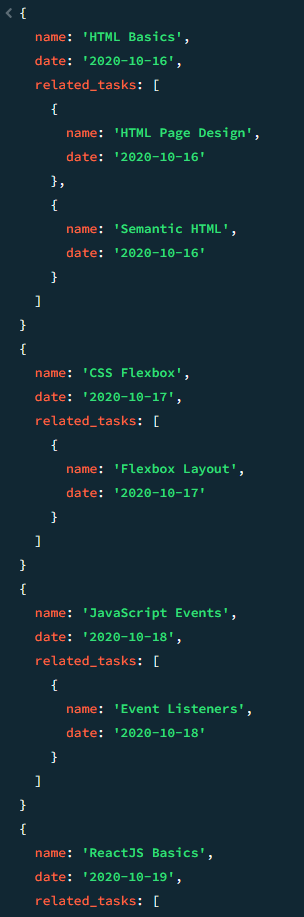
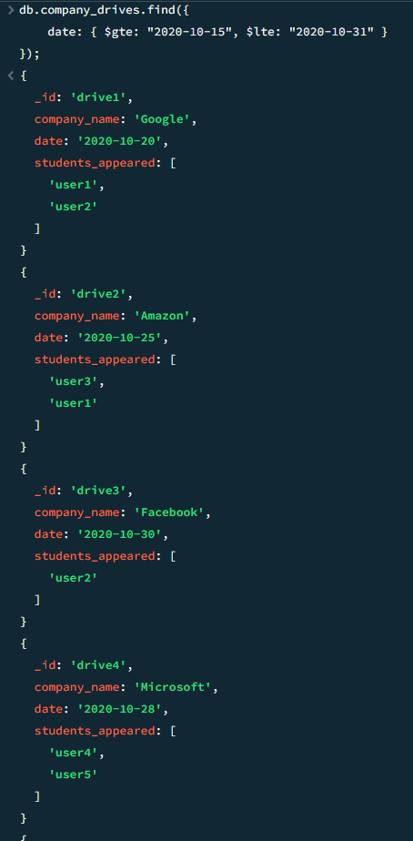
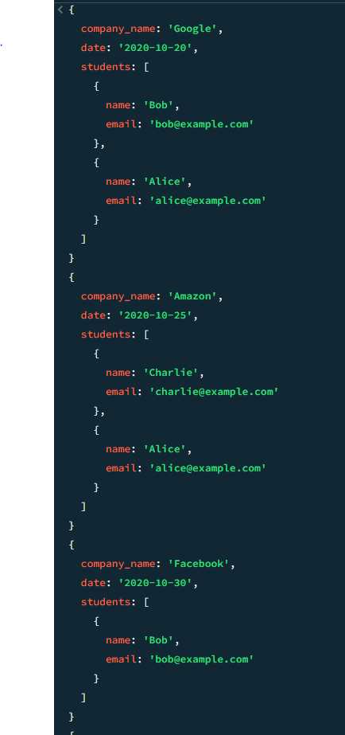
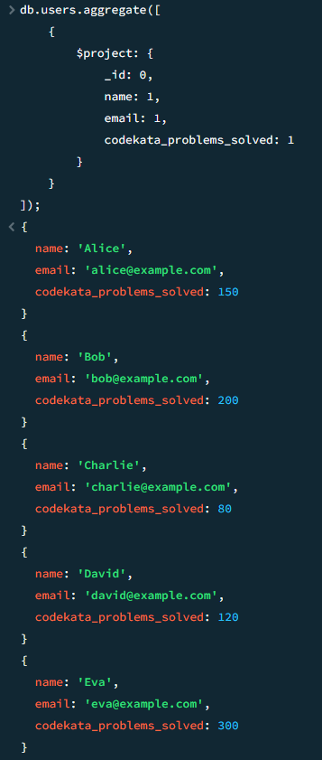

1. Create and use the database
   
```js
use zen_class_program;
```

3. Create collections
*users
*codekata
*attendance
*topics
*tasks
*company_drives
*mentors

1. users

```js
db.users.insertMany([
    {
        "_id": "user1",
        "name": "Alice",
        "email": "alice@example.com",
        "codekata_problems_solved": 150
    },
    {
        "_id": "user2",
        "name": "Bob",
        "email": "bob@example.com",
        "codekata_problems_solved": 200
    },
    {
        "_id": "user3",
        "name": "Charlie",
        "email": "charlie@example.com",
        "codekata_problems_solved": 80
    },
    {
        "_id": "user4",
        "name": "David",
        "email": "david@example.com",
        "codekata_problems_solved": 120
    },
    {
        "_id": "user5",
        "name": "Eva",
        "email": "eva@example.com",
        "codekata_problems_solved": 300
    }
]);
```

2. codekata

```js
db.codekata.insertMany([
    {"_id": "ck1", "user_id": "user1", "problems_solved": 150},
    {"_id": "ck2", "user_id": "user2", "problems_solved": 200},
    {"_id": "ck3", "user_id": "user3", "problems_solved": 80},
    {"_id": "ck4", "user_id": "user4", "problems_solved": 120},
    {"_id": "ck5", "user_id": "user5", "problems_solved": 300}
]);
```

3. Attendance

```js
db.attendance.insertMany([
    {"_id": "att1", "user_id": "user1", "date": "2020-10-16", "status": "present"},
    {"_id": "att2", "user_id": "user1", "date": "2020-10-17", "status": "absent"},
    {"_id": "att3", "user_id": "user2", "date": "2020-10-16", "status": "present"},
    {"_id": "att4", "user_id": "user2", "date": "2020-10-17", "status": "present"},
    {"_id": "att5", "user_id": "user3", "date": "2020-10-16", "status": "absent"},
    {"_id": "att6", "user_id": "user3", "date": "2020-10-17", "status": "present"},
    {"_id": "att7", "user_id": "user4", "date": "2020-10-16", "status": "present"},
    {"_id": "att8", "user_id": "user4", "date": "2020-10-17", "status": "present"},
    {"_id": "att9", "user_id": "user5", "date": "2020-10-16", "status": "present"},
    {"_id": "att10", "user_id": "user5", "date": "2020-10-17", "status": "absent"}
]);
```


4. topics

```js
db.topics.insertMany([
    {"_id": "topic1", "name": "HTML Basics", "date": "2020-10-16"},
    {"_id": "topic2", "name": "CSS Flexbox", "date": "2020-10-17"},
    {"_id": "topic3", "name": "JavaScript Events", "date": "2020-10-18"},
    {"_id": "topic4", "name": "ReactJS Basics", "date": "2020-10-19"},
    {"_id": "topic5", "name": "NodeJS Basics", "date": "2020-10-20"}
]);
```


5. tasks

```js
db.tasks.insertMany([
    {"_id": "task1", "topic_id": "topic1", "name": "HTML Page Design", "date": "2020-10-16"},
    {"_id": "task2", "topic_id": "topic1", "name": "Semantic HTML", "date": "2020-10-16"},
    {"_id": "task3", "topic_id": "topic2", "name": "Flexbox Layout", "date": "2020-10-17"},
    {"_id": "task4", "topic_id": "topic3", "name": "Event Listeners", "date": "2020-10-18"},
    {"_id": "task5", "topic_id": "topic4", "name": "Create a React App", "date": "2020-10-19"}
]);
```
6. company_drives

```js
db.company_drives.insertMany([
    {"_id": "drive1", "company_name": "Google", "date": "2020-10-20", "students_appeared": ["user1", "user2"]},
    {"_id": "drive2", "company_name": "Amazon", "date": "2020-10-25", "students_appeared": ["user3", "user1"]},
    {"_id": "drive3", "company_name": "Facebook", "date": "2020-10-30", "students_appeared": ["user2"]},
    {"_id": "drive4", "company_name": "Microsoft", "date": "2020-10-28", "students_appeared": ["user4", "user5"]},
    {"_id": "drive5", "company_name": "Apple", "date": "2020-10-22", "students_appeared": ["user3"]}
]);
```
7. mentors


```js
db.mentors.insertMany([
    {"_id": "mentor1", "name": "John", "mentees": ["user1", "user2", "user3"]},
    {"_id": "mentor2", "name": "Jane", "mentees": ["user4", "user5", "user1", "user3"]},
    {"_id": "mentor3", "name": "Alice", "mentees": ["user2", "user5"]},
    {"_id": "mentor4", "name": "Bob", "mentees": ["user1", "user4", "user3", "user2", "user5"]},
    {"_id": "mentor5", "name": "Eve", "mentees": ["user3", "user4"]}
]);
```


# Queries

1. Find all the topics and tasks taught in October 2020


```js 
db.topics.aggregate([
    {
        $lookup: {
            from: "tasks",
            localField: "_id",
            foreignField: "topic_id",
            as: "related_tasks"
        }
    },
    {
        $match: {
            date: { $gte: "2020-10-01", $lte: "2020-10-31" }
        }
    },
    {
        $project: {
            _id: 0,
            name: 1,
            date: 1,
            "related_tasks.name": 1,
            "related_tasks.date": 1
        }
    }
]);
```




2. Find all the company drives held between October 15, 2020, and October 31, 2020


```js
db.company_drives.find({
    date: { $gte: "2020-10-15", $lte: "2020-10-31" }
});
```





3. Find all company drives and the students who appeared for placements


```js
db.company_drives.aggregate([
    {
        $lookup: {
            from: "users",
            localField: "students_appeared",
            foreignField: "_id",
            as: "students"
        }
    },
    {
        $project: {
            _id: 0,
            company_name: 1,
            date: 1,
            "students.name": 1,
            "students.email": 1
        }
    }
]);
```





4. Find the number of problems solved by each user in Codekata


```js
db.users.aggregate([
    {
        $project: {
            _id: 0,
            name: 1,
            email: 1,
            codekata_problems_solved: 1
        }
    }
]);
```




5. Find all mentors with mentees count greater than 15

```js
db.mentors.aggregate([
    {
        $project: {
            name: 1,
            mentees_count: { $size: "$mentees" }
        }
    },
    {
        $match: {
            mentees_count: { $gt: 15 }
        }
    }
]);
```


6. Find the number of users who were absent and did not submit tasks between October 15, 2020, and October 31, 2020


```js
db.attendance.aggregate([
    {
        $match: {
            status: "absent",
            date: { $gte: "2020-10-15", $lte: "2020-10-31" }
        }
    },
    {
        $lookup: {
            from: "tasks",
            localField: "user_id",
            foreignField: "user_id",
            as: "tasks"
        }
    },
    {
        $unwind: "$tasks"
    },
    {
        $match: {
            "tasks.submitted": false
        }
    },
    {
        $group: {
            _id: null,
            count: { $sum: 1 }
        }
    }
]);
```
